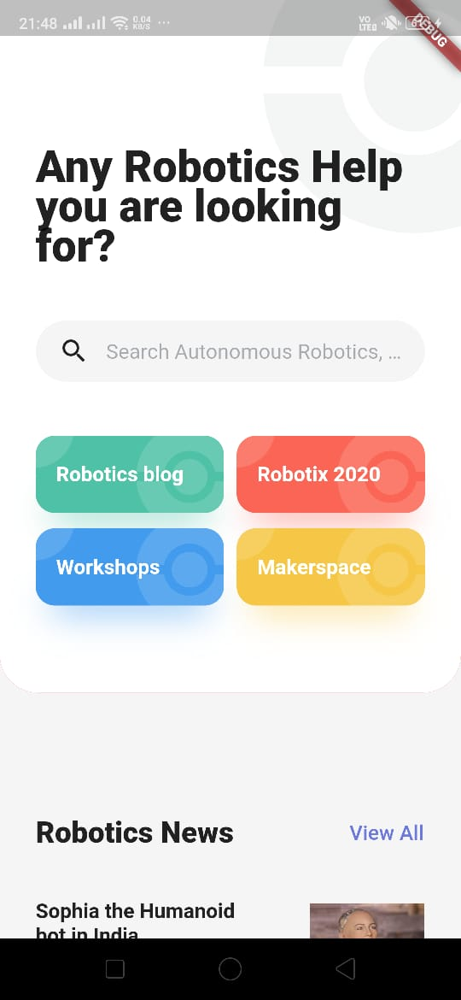
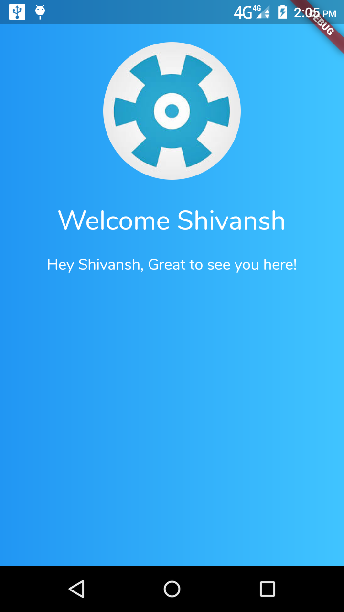
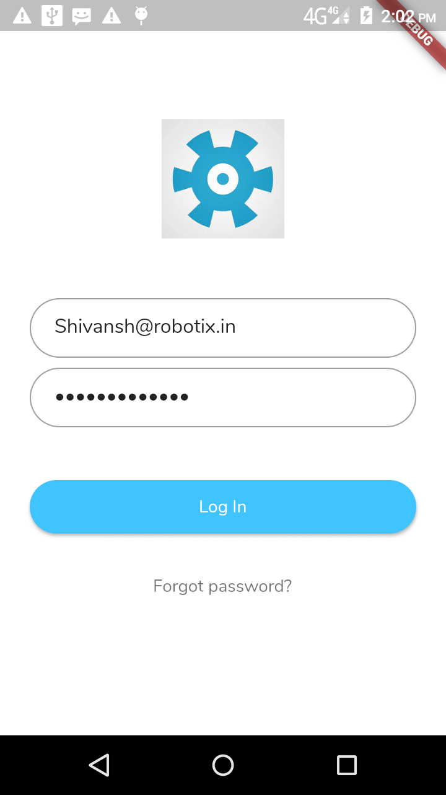
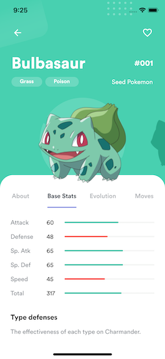
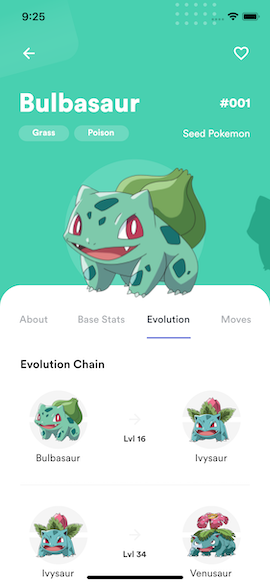

# Flutter Pokedex

Robotix app based on Pokedex App

## Download

Go to the [releases page](https://github.com/scitbiz/flutter_pokedex/releases) to download the latest available apk.

## App preview

<!-- 

") -->

## Installation

- Add [Flutter](https://flutter.dev/docs/get-started/install) to your machine

- Open this project folder with Terminal/CMD and run `flutter packages get`

- Run `flutter run` to build and run the debug app on your emulator/phone

## Thanks

- [Saepul Nahwan](https://dribbble.com/saepulnahwan23) for his [Pokedex App design](https://dribbble.com/shots/6545819-Pokedex-App)
- [Flutter](https://flutter.dev) for the great cross platform framework

## License

All the code available under the MIT + Apache 2.0. licenses. See [LICENSE](LICENSE).
